#  Cloth Shop Management System

The Cloth Shop Management System offers a range of features to enhance the order process.

🎗️𝗧𝗲𝗰𝗵𝗻𝗼𝗹𝗼𝗴𝘆 𝘀𝘁𝗮𝗰𝗸

☑️MERN Stack☑️

Front End :

☑️React
☑️Tailwind
☑️JavaScript
☑️Axios

Back End :

☑️Express.js
☑️MongoDB
☑️Mongoose
☑️Node.js
☑️JWT

## Features

- Main Page

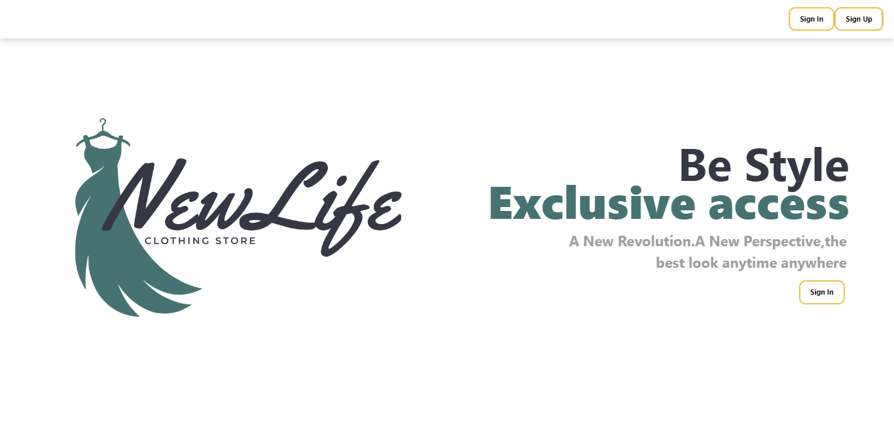

- Sign In Page

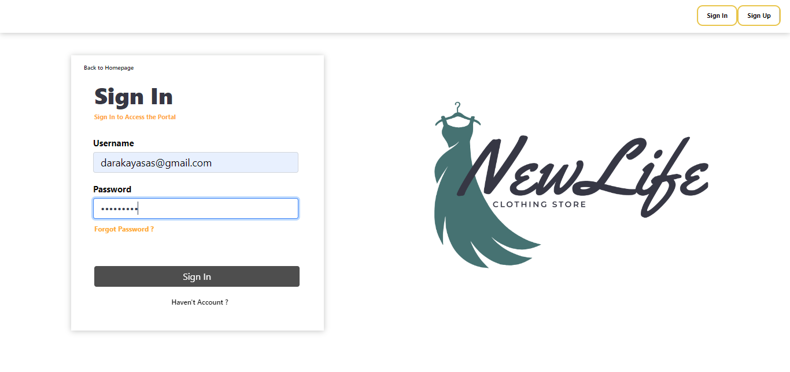

- Sign Up Page

### Admin Features

- Customers Manage

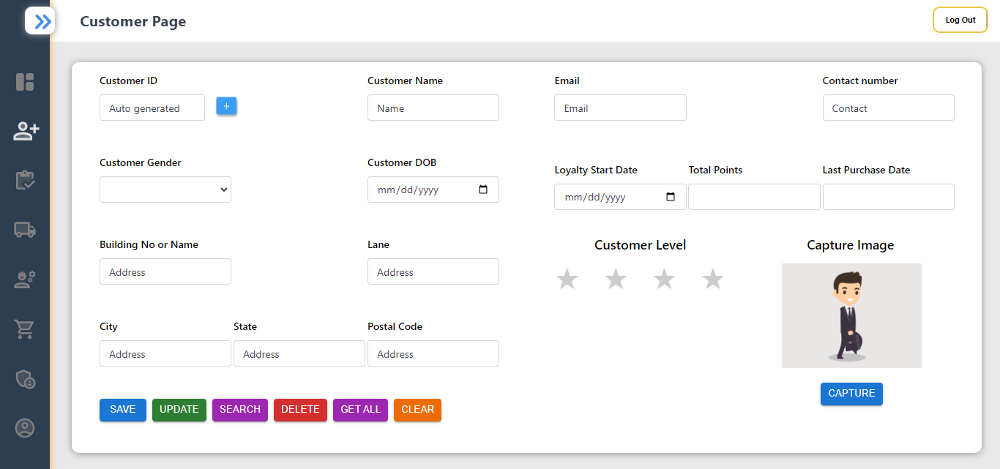

- Inventory Manage

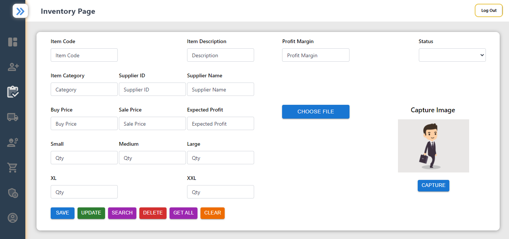

- Supplier Manage 

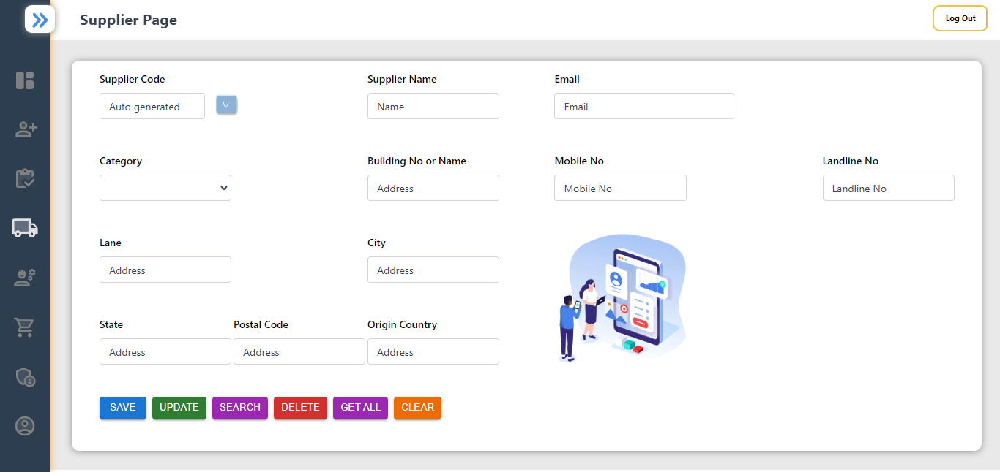

- Employee Manage

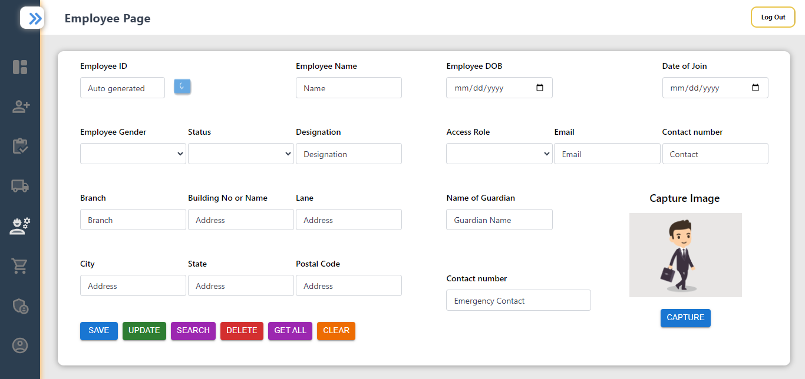

- Sales Manage

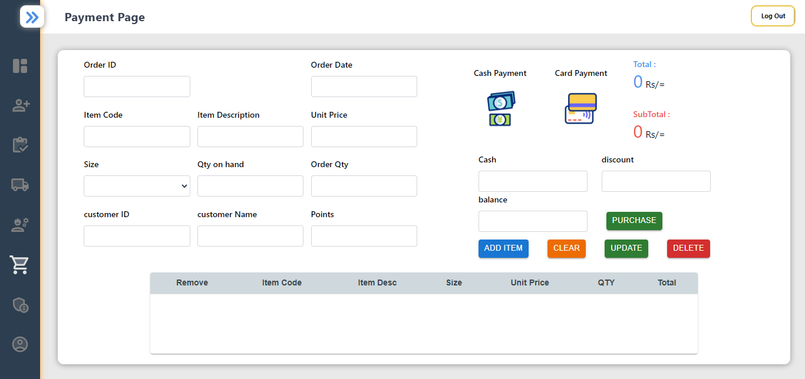

- Admins Manage

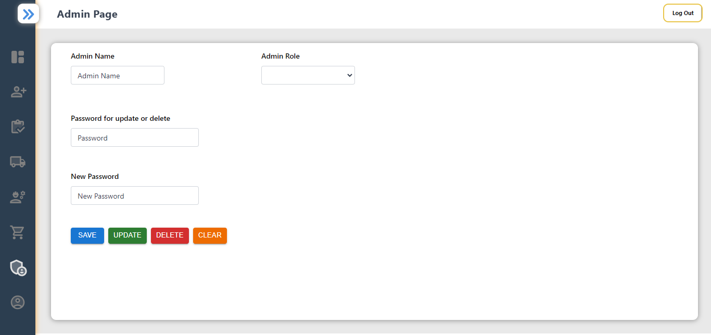

- Table View

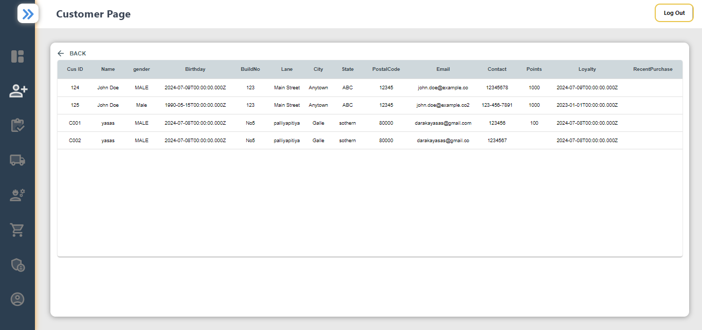

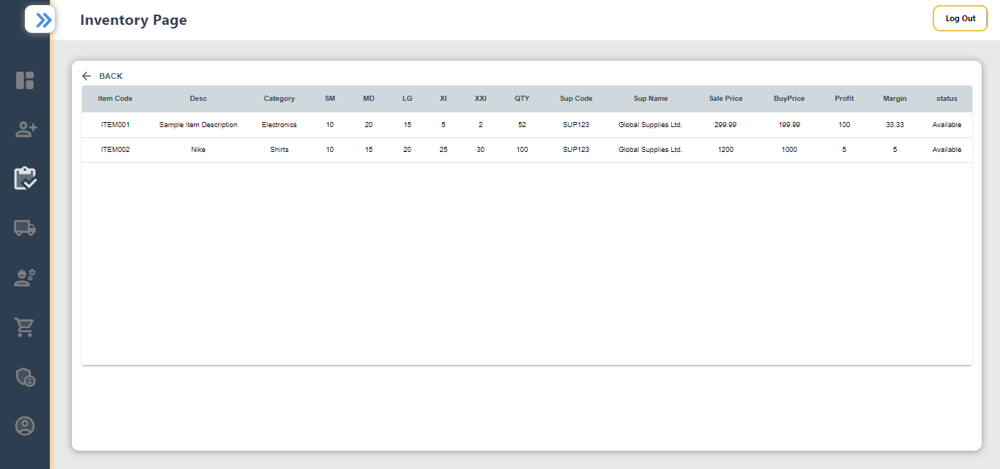

### Notifications

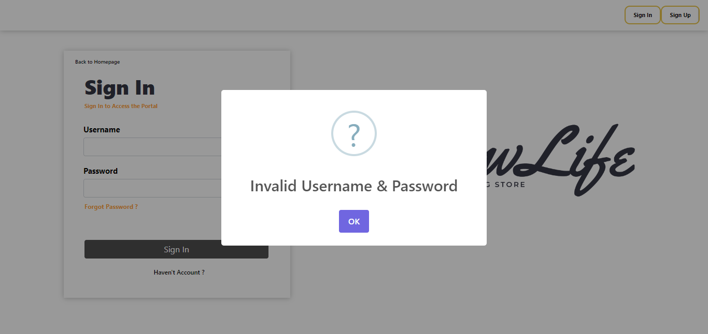